# EFK Stack on Kubernetes with ECK (Elasticsearch, Fluent Bit, Kibana)

This repository provides a streamlined way to deploy a **highly available EFK stack (Elasticsearch, Fluent Bit, Kibana)** on Kubernetes using the Elastic Cloud on Kubernetes (**ECK**) Operator and Kubernetes Custom Resource Definitions (**CRDs**).

## 📘 Introduction

This project provides a robust and **Production-Ready** deployment of the EFK stack Elasticsearch, Fluent Bit, and Kibana on Kubernetes, utilizing the Elastic Cloud on Kubernetes (ECK) operator and Kubernetes-native Custom Resource Definitions (CRDs).

It enables high-availability log aggregation, centralized visualization, and observability across your Kubernetes environment with minimal manual overhead.

## 📦 Table of Contents

- [Introduction](#introduction)
- [Architecture Overview](#architecture-overview)
- [Key Features](#key-features)
- [Prerequisites](#prerequisites)
- [Installation Guide](#installation-guide)
- [Usage Instructions](#usage-instructions)
- [Configuration](#configuration)
- [Management](#management)
- [Upgrading Elasticsearch](#upgrading-elasticsearch)
- [Accessing Kibana](#accessing-kibana)
- [Customization Tips](#customization-tips)
- [File Reference](#file-reference)
- [Fluent Bit vs. Alternatives](#fluent-bit-vs-alternatives)
- [License](#license)
- [Contributing](#contributing)
- [Contact Information](#contact-information)
- [Additional Resources](#additional-resources)


## 🧰 Architecture Overview

This project deploys a complete, Kubernetes-native EFK stack managed via the ECK operator.

> Elasticsearch — High-availability log indexing cluster.

Components:

- 📦 **Elasticsearch** — High-availability log indexing cluster.
- 🔍 **Fluent Bit** — Lightweight log shipper running as a DaemonSet.
- 📊 **Kibana** — UI for log exploration and dashboards.
- 🎛️ **ECK Operator \& CRDs** — Lifecycle management and orchestration for Elastic-stack components.


## 🚀 Key Features

- Native Kubernetes integration using CRDs.
- Scalable multi-node Elasticsearch cluster:
  with role **["master", "data", "ingest", "transform"]**
    - 3 master nodes
    - 5 data-ml nodes
    - 3 ingest nodes
- Automated deployment and upgrades via ECK.
- Fluent Bit for efficient log collection and forwarding.
- Kibana integration for real-time log insights.
- Easy to monitor, troubleshoot, and extend.


## 📋 Prerequisites

Before deployment, ensure the following:

- A running Kubernetes cluster (version 1.30+ recommended)
- kubectl configured to access your cluster
- Adequate hardware resources allocated for Elasticsearch (CPU, memory, and disk)


## ⚙️ Installation Guide

### Step 1: Apply Custom Resource Definitions (CRDs)

Enable support for Elastic stack resources in your cluster:

```bash
kubectl apply -f elastic-customresourcedefinition.yaml
```


### Step 2: Deploy the ECK Operator

Install the ECK operator to manage your Elastic components:

```bash
kubectl apply -f eck-operator.yaml
```

Wait until the operator pod is running and ready.

### Step 3: Deploy Elasticsearch

Provision a resilient Elasticsearch cluster:

```bash
kubectl apply -f elasticsearch.yaml
```


### Step 4: Deploy Kibana

Set up Kibana, which connects automatically to Elasticsearch:

```bash
kubectl apply -f kibana.yaml
```


### Step 5: Deploy Fluent Bit

Install Fluent Bit to collect logs at the node level and forward them to Elasticsearch:

```bash
kubectl apply -f fluent-bit.yaml
```


## 🖥️ Usage Instructions

Once all components are running, Fluent Bit will automatically begin collecting logs from all Kubernetes nodes and forwarding them to Elasticsearch.

To visualize logs:

1. Access Kibana (see steps below).
2. Create an index pattern such as:

```plaintext
fluentbit-*
```

3. Navigate to the Discover tab to search and filter logs in real time.

## 🔧 Configuration

You may customize the deployment to better fit your environment:

- Resource Limits: Adjust CPU and memory limits within the `*.yaml` files.
- Environment Variables:
    - Modify Fluent Bit settings for parsing and tagging.
    - Configure Kibana or Elasticsearch via respective CR spec under `spec.config`.

Security Considerations:

- Enable TLS for secure communication (optional via ECK configuration).
- Apply Kubernetes RBAC roles/policies for restricted access.
- Add persistent volume claims to Elasticsearch for data durability.


## 🔎 Management

Monitor status and troubleshoot all components:

```bash
kubectl get elasticsearch,kibana,pods -n observability
```

Check ECK Operator logs for controller-level diagnostics:

```bash
kubectl logs -n elastic-system deployment/elastic-operator
```
## 🔄 Upgrading Elasticsearch

ECK provides a **safe and automated way** to upgrade Elasticsearch versions without data loss through rolling upgrades. The operator handles the entire process, including data migration and node management.

### How ECK Handles Upgrades

ECK automatically manages the upgrade process by:

- Creating new nodes with the newer Elasticsearch version
- Migrating data from old nodes to newer ones
- Removing older nodes after successful data migration
- Preserving PersistentVolumes during the upgrade process


### Step-by-Step Upgrade Process

**1. Verify ECK Operator Compatibility**

Before upgrading Elasticsearch, ensure your ECK operator version is compatible with the target Elasticsearch version.

**2. Modify the Elasticsearch Manifest**

Simply update the `version` field in your Elasticsearch YAML manifest:

```yaml
apiVersion: elasticsearch.k8s.elastic.co/v1
kind: Elasticsearch
metadata:
  name: elasticsearch
  namespace: observability
spec:
  version: 8.18.3  # Update to your desired version
  nodeSets:
  - name: master
    count: 3
    config:
      node.roles: ["master"]
    # ... rest of your configuration
```

**3. Apply the Updated Configuration**

Deploy the updated manifest:

```bash
kubectl apply -f elasticsearch.yaml
```

The ECK operator will automatically detect the version change and initiate the rolling upgrade process.

### Monitoring the Upgrade

Monitor the upgrade progress with:

```bash
# Check overall cluster status
kubectl get elasticsearch -n observability

# Monitor pods during upgrade
kubectl get pods -n observability -w

# Check ECK operator logs
kubectl logs -n elastic-system deployment/elastic-operator
```


### Important Considerations

- **Rolling Upgrades**: Supported between compatible versions (typically minor versions)
- **Major Upgrades**: May require specific upgrade paths or intermediate versions
- **Breaking Changes**: Always review Elasticsearch release notes for breaking changes


### Data Safety Measures

Before upgrading, consider these safety measures:

1. **Create Snapshots**: Take a snapshot of your cluster data
2. **Backup Configuration**: Save your current Elasticsearch configuration
3. **Test Environment**: Test the upgrade in a non-production environment first
4. **Monitor Resources**: Ensure adequate resources during the upgrade process

### Troubleshooting Common Issues

**Upgrade Stuck or Failed**

If the upgrade process stalls:

1. Check ECK operator logs for error messages
2. Verify cluster health: `kubectl get elasticsearch -n observability`
3. Ensure sufficient resources are available
4. Review Elasticsearch pod logs for specific errors

**Preventing Automatic Upgrades**

To temporarily prevent upgrades, use the unmanaged annotation:

```bash
kubectl annotate elasticsearch elasticsearch eck.k8s.elastic.co/managed=false -n observability
```

Remove the annotation when ready to proceed:

```bash
kubectl annotate elasticsearch elasticsearch eck.k8s.elastic.co/managed- -n observability
```


### Best Practices

1. **Gradual Upgrades**: Upgrade one minor version at a time for major version jumps
2. **Resource Planning**: Ensure adequate CPU, memory, and storage during upgrades
3. **Monitoring**: Continuously monitor cluster health and performance
4. **Documentation**: Keep track of upgrade history and configurations
5. **Rollback Plan**: Prepare a rollback strategy in case of issues


## 🌐 Accessing Kibana

To access Kibana locally:

```bash
kubectl port-forward service/kibana-kb-http 5601:5601 -n observability
```

Then open your browser to:

```plaintext
http://localhost:5601
```

Optional: Expose Kibana externally using a Service of type LoadBalancer or an Ingress controller.

## 🛠️ Customization Tips

- Adjust the number of Elasticsearch nodes for your scaling needs.
- Use custom Fluent Bit parsers in `fluent-bit.yaml` for structured logs.
- Enable snapshot repositories in Elasticsearch for persistent backups.
- For development environments, reduce replica counts and resource allocation.


## 📁 File Reference

| File Name | Description |
| :-- | :-- |
| `elastic-customresourcedefinition.yaml` | Defines Elastic Stack CRDs for Kubernetes |
| `eck-operator.yaml` | Deploys the ECK Operator for lifecycle management |
| `elasticsearch.yaml` | Defines the multi-node Elasticsearch cluster |
| `kibana.yaml` | Deploys Kibana as a UI for Elasticsearch logs |
| `fluent-bit.yaml` | Chaos-free log shipping via Fluent Bit DaemonSet |


## 🔄 Fluent Bit vs. Alternatives

When considering Fluent Bit for log shipping, it's helpful to compare it against leading alternatives. The table below summarizes how Fluent Bit stands in relation to Fluentd, Logstash, Promtail, and Vector across key feature areas:


| Feature | Fluent Bit | Fluentd | Logstash | Promtail | Vector |
| :-- | :--: | :--: | :--: | :--: | :--: |
| **Lightweight** | ✅ | ❌ | ❌ | ✅ | ✅ |
| **Ease of Configuration** | ✅ | ✅ | ❌ | ✅ | ✅ |
| **Kubernetes Metadata** | ✅ | ✅ | ❌ | ✅ | ✅ |
| **Performance** | ✅ | ❌ | ❌ | ✅ | ✅ |
| **Versatility** | ✅ | ✅ | ✅ | ❌ | ✅ |

**Key Takeaways:**

- **Fluent Bit** excels in lightweight performance, ease of configuration, and Kubernetes integration.
- **Vector** is similarly strong in most areas, but Fluent Bit is specifically designed for minimal resource usage.
- **Fluentd** and **Logstash** offer high versatility but at the cost of resource usage and, at times, configuration complexity.
- **Promtail** is lightweight and easy to configure, but less versatile compared to Fluent Bit.


## 📄 License

This project is licensed under the default **Elasticsearch Basic License**.

### Summary of Basic License Terms: Free and open

- ✅ Free to use and distribute for development and production
- ✋ Prohibits sublicensing, selling, and certain forms of redistribution
- ❗ Open-source; source-available with specific usage rights

For detailed terms, please refer to:
➡️ https://www.elastic.co/licensing/elastic-license

## 🤝 Contributing

Contributions are welcome!

To contribute:

1. Fork the repository.
2. Create a feature or bugfix branch.
3. Submit a pull request with a clear description of your changes.

Please ensure your code is well-documented and adheres to the existing style guidelines.

## 📬 Contact Information

For questions, support, or reporting issues, please reach out via:

- GitHub Issues: [Submit here](https://github.com/pramodksahoo)
- Email: devopspramod100@gmail.com


## 📚 Additional Resources

- 📑 [Elastic Official Documentation](https://www.elastic.co/docs/deploy-manage/deploy/cloud-on-k8s)
- 📦 [ECK Operator Documentation](https://www.elastic.co/guide/en/cloud-on-k8s/current/index.html)
- 🧪 [Fluent Bit Docs](https://docs.fluentbit.io/)
- 👥 [Elasticsearch Community Forums](https://discuss.elastic.co/)

> ✨ Happy Logging! Enhance your observability with ease and precision using our EFK stack deployment strategy.

---

**Note**: This deployment is optimized for production use. For development environments, consider reducing resource requirements and using a single node configuration.
